# AppCreator documentation

This the the AppCreator documentation, powered by [LocSys](https://locsys.issel.ee.auth.gr/). AppCreator enables the utilization of heterogeneous toolboxes towards creating complex, multi-domain, flow/FSM based applications.

AppCreator follows a classical FSM-like approach, i.e. each node is executed and passes the execution batton into its next connection, as well as supports conditions to divert the flow according to checks.

Nevertheless, since the modern brokered systems are asynchronous in nature, AppCreator also supports enhancements over the classical FSM, i.e. execution of parallel threads and preemtion of threads according to conditions.

Finally, a design decision was to not support passing values from one node to another, but maintain a pool of variables that can be accessed from all nodes. This way the philosophy of creating an app is not about correctly manipulating data through the nodes, but use variables and focus on the logic part.

Next, the documentation of the two basic AppCreator toolboxes will be given, that offer the basis for all apps to be created.

## 1. Some background knowledge

### 1.1 Variables value substitution

When you want to use a variable's value in a field or replace it in an expression, you should use `{}`. For example, if I have the variable `x` whose value is `3` and I want to log `x = 3`, I should put this in the Log node:

> `x = {x}`

This way, the `{x}` will be substituted with the variable's value and the final output will be `x = 3`

### 1.2 Evaluating expressions

If you want to evaluate an expression which possibly includes variables (this does not apply for the Condition node, to be discussed later), you can enclose the expression in `||`. For example, if I want to log the double of the value of `x` I should out this in the Log node:

> `The double of variable x is |2 * {x}|`

This way, first the variables' values are substituted and the expression becomes `The double of variable x is |2 * 3|`, and then whatever is in `||` it is evaluated by Python, so the final output will be `The double of variable x is 6`.  

This has several implications, since this way you can use actual Python libraries, e.g. `|math.min({x})^5|`.

### 1.3 Variables as data structures

In the case where a variable is a list or a json object (dictionary), you can access its elements using the dot notation. 

If we have a list `my_list = [0, 4, 7, 9]`, you can use `{my_list.1}` to get the element in the 1st place, i.e. 4.

If we have a dictionary like the following:
```
robot_pose_x = {
    pose: {
        x: 5
        y: 8.4
        theta: 0.34
    }
}
```

you can access x like this: `{robot_pose_x.pose.x}`.

### 1.4 Nodes connectivity rules

There are two rules when connecting nodes:
- No input and output handles must remain unconnected. If you leave them unconnected, the validation will fail
- You can connect each output handle only once, but every input handle multiple times. This means that each output directs to a single node, but each input can be visited by many nodes.

### 1.5 Nodes properties

Some nodes have a little cog icon by their side. This means that they have properties that can be configured. Press the cog to see them.

If an orange exclamation mark exists besides a node, this means that it contains some properties that are obligatory and have not been set. Example:

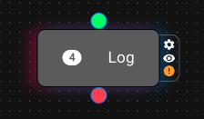

## 2. AppCreator environment and Hello world

This is how the AppCreator environment looks like:

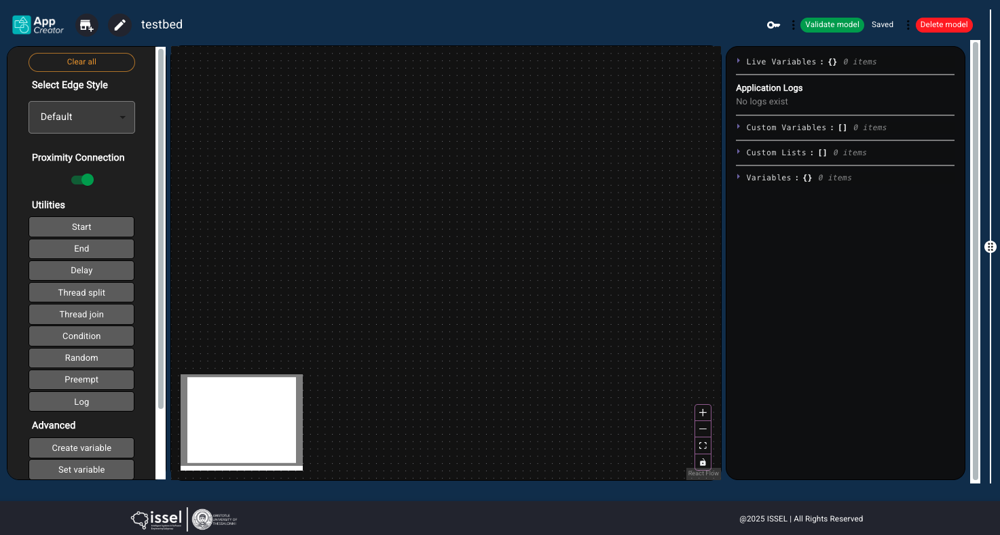

There are three distinct areas:
- At the left we can see the **toolboxes** column. It contains all nodes of both the basic and other toolboxes, as well as options for the connectivity visualization of the application.
- At the middle there is the **application creation** canvas. You can drag and drop nodes from the toolboxes here, connect them and create apps.
- At the right there is the **logs and variables** column. This is more technical, so it will be described later on.

The hello world application of AppCreator contains two nodes, the Start and End node, which must always exist in any application. So the Hello world app looks like this:

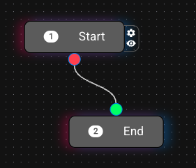

At the top right of the AppCreator window there is a green button called `Validate model`. If you press this several consistency and sanity checks will be performed to your model, in order to be sure that the **structure** of the application is correct. Unfortunately, we cannot do this for the **logic** of your app, so you are responsible if anything goes wrong!

If any mistakes exist, a) they will appear at the top of the **logs and variables** column, b) the corresponding nodes will have a red highlight, and c) a bug icon will also appear in the respective nodes, which on hover will show you the error. For example, in the following application, two mistakes exist (the connections are missing).

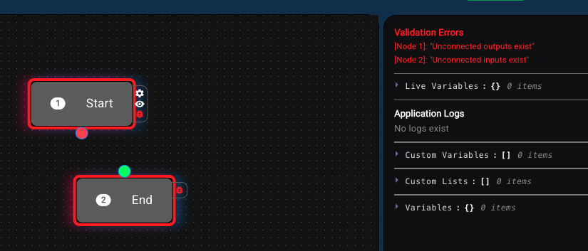

If your model is validated, a green indication will appear, and the `Deploy code` orange button will appear. If you press the `Deploy code` button, you will see the following message:

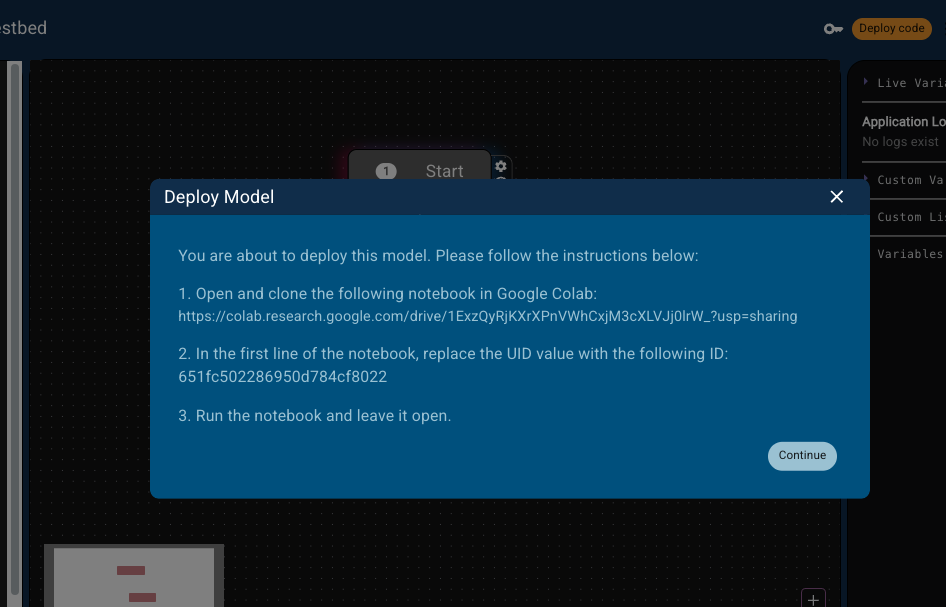

If you **really** want to deploy, do what it tells you and press Continue!

## 3. The Utilities toolbox

### § *Start*

The Start node must exist in each application, since the deployment starts from there. Its configuration has one property called `Artificial delay`. This is measured in seconds and denotes a delay that will be added after each node's execution. Use this in order to have time to see the actual flow.

Fun fact: you can have multiple Start nodes in your application. This means that the flows starting from these nodes will be initialized and executed in parallel.

### § *End*

If you have a Start node, you must also have an End node. The End node is just the final node of an application, nothing more, nothing less.

### § *Delay*

The Delay node is used to introduce a delay in the execution of the flow. It has one obligatory parameter, which is the delay is seconds.

This parameter is evaluated, thus you can use variables as well (e.g. `{x}` where x is 3, will result in 3 seconds of delay).

### § *Log*

Log is an assistive node which prints whatever expression you add as its parameter. It has one parameter which is handled as a string, and it is evaluated as explained in sections 1.1 and 1.2.

The results appear in the "Application logs" section at the right column, as such:

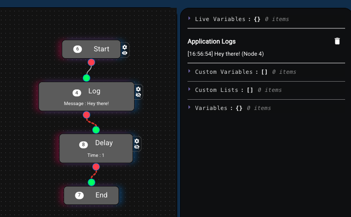

### § *Random*

Random is a node that allows for randomness in the flow. It has the following typical form, which includes one entry point and N output handles, where `N>1`.

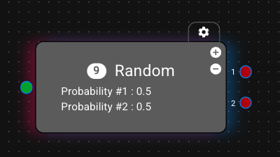

As evident, this node has two buttons denoted with the plus and minus signs `(+, -)`. If you press the `+` one more output is added, and the last output is removed when you press the `-`.

The configuration of a Random node with 3 outputs is evident below:

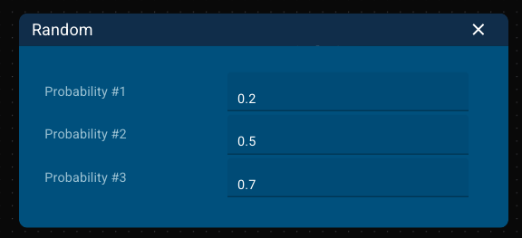

Each input box is associated with its respective output and the number inside represents the possibility of randomly selecting this exact output. E.g. in the above ./assets/image, output 1 will be selected with a probability of 0.2 (or 2 out of 10 times), whereas output 3 will be randomly selected with a probability of 0.7. In the specific example, the sum of all numbers equals 1.0, but this is not a limitation for this node. You can include whatever numbers you want, and the probability will be computed relatively to the sum of these numbers.

For example in the below case, output 2 will be selected with a probability of 9/(12+9+3) = 9/24.

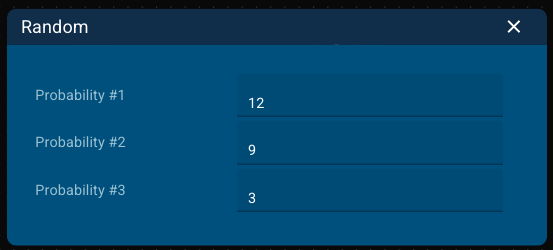

### § *Condition*

Condition is another node with 1 input and N outputs, where N>1. A typical view of a Condition node with 3 outputs is the following:

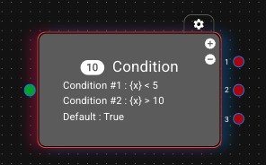

Here, you declare N-1 conditions, and a "default" condition exists which is always True. The conditions are checked in the order of appearance, thus first Condition #1 will be evaluated, if it is False Condition #2 will be evaluated, and if it is False, the Default condition will be always met. Thus, since a default condition always exist you do not have to create all conditions that are logically complementary.

Each input text for each condition is evaluated, thus you can include `{}` for variables substitution or `||` for pythonic evaluation. In the aove example, if variable `x` is smaller than 5 the first output is selected, if it is larger than 10 the second output is selected, and it it is neither (thus `5 <= x <= 10`) the third output is selected.

### § *Thread split* and *Thread join*

The Thread split and Thread join nodes offer parallelism in your applications. As we said, AppCreator offers a synchronous, FSM-like flow from node to node. If you want process to be executed in parallel you must use a Thread split node.

A typical Thread split node with 3 outputs is evident below. When this is used, three threads will initiate and be executed in parallel, deploying the subflows connected to the three outputs.

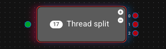

The parallelism stops in a Thread join node. This node has N inputs and one output. Each of the inputs handles the ending of a thread, and the node concludes its execution when all the incoming threads are done.

A simple example follows:

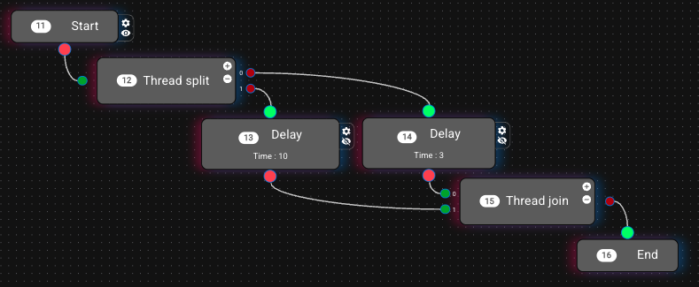

Here the application will start and two delays will be executed in parallel (3 and 10 seconds).
The 3 seconds delay will end after 3 seconds (duh) and the execution flow will reach the input 0 of the join node. Since the second thread (the one with the 10 seconds delay) has not finished yet, the application execution stays in the join node for another 7 seconds, when the 10 second delay terminates as well. Then the application terminates.

### § *Preempt*

Even though the Thread nodes are powerful to handle real world problems, where several things happen at the same time, you will find out that you will usually combine them with the Preempt node. 

Preemption is an operation that can stop (kill) a whole thread. For example, if you have a Thread node with two outputs (thus it creates two threads), and at output 1 (the last) you add a Delay of 1 second and then a Preempt node, for which you select the kill the above thread, the whole execution of this thread will stop after 1 second.

Let's see a more realistic (and complex) example:

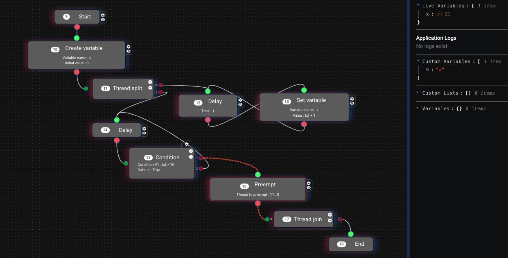

Here we create a variable called `x` with initial value equal to 0, and then we create a thread split with two threads. The first thread (Node 11, output 0) executes a delay and increases the value of `x` by 1 for eternity.
The second thread (Node 11, output 1) executes in a loop a delay and a condition that checks if `x>10`. If no, the execution repeats the delay/condition pair. If yes, the flow reaches a preempt node, which kills the Thread 11, output 0 (so it stops the above thread and variable `x` stops to increase).

The catch here is that the Thread join node has only 1 input connection, since thread 0 is eternal, thus it never "joins". When the preemption happens, thread #1 joins, thread #0 terminates and the flow reaches the End node.

Even though this application could be created by designing a simple loop that included the variable update, delay and condition, there are cases where specific nodes are used which are blocking and last several seconds or even minutes, therefore, preemption is the proper way to kill them. Futhermore preemption is a way to stop several threads (not only one).

**Disclaimer**: When you are using Preemptions you must know what you are doing! It is proposed to use Preemptions to kill threads that originate from the same Thread Split node the actual Preemption is in, else you must REALLY know what you are doing!

### § *Create variable*

This node allows for declaring the creation of a new variable. A typical example of this node is the following:

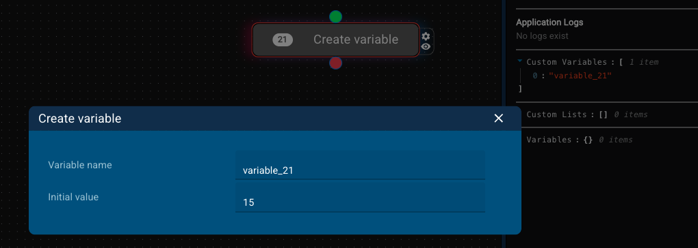

In this node you must declare the variable's name (which is restricted according to pythonic variables naming rules), and the variable's initial value. The value can be a number, a string or an expression that will be evaluated (e.g. `|{x} + 2|`).
This variable falls under the category of "Custom" variables, to differentiate them from variables that are automatically introduced from 3rd party toolboxes. Thus, these variables are also visible in the right column, under the "Custom variables" section.

### § *Set variable*

This node updates the value of a variable that has been created using the "Create variable" node. A typical example is this:

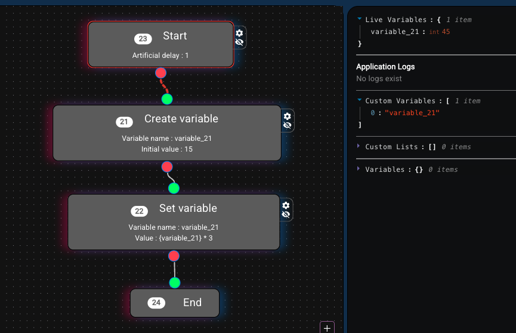

Here, a variable called `variable_21` is created with an initial value of 15, and then its value is set to `3 * {variable_21}`, thus the final value is 45 (as shown in the live variables section at the right).

### § *Create list*

The Create list node... creates a list! A typical example of the Create list node is the following:

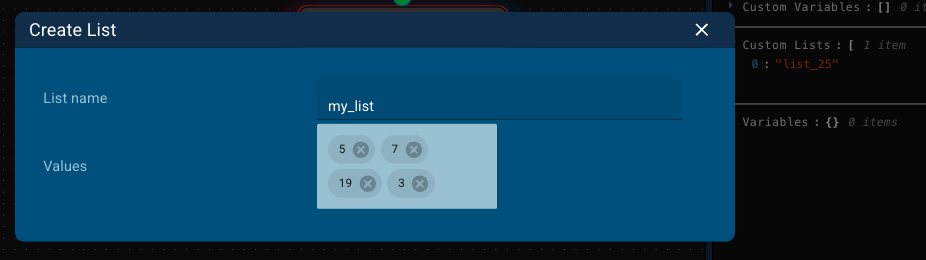

It should be stated that a list is a custom variable as well, but it is kept in a different place (the Custom lists section at the right) to be easier to distinguish. Like the custom variables you need to provide a name, and a set of initial elements by adding a value and pressing Enter (return).

### § *Manage list*

This node offers standard functions over lists, i.e. to delete an element, to add an element, and to order (ascending or descending). A typical view of this node follows:

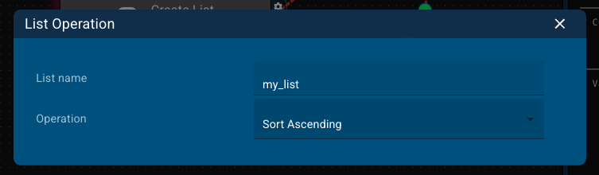

The name of the list must be declared, and the operation should be selected from a dropdown.
An example application where a list is created, is ordered in ascending order and the first element is logged follows:


It should be stated that this node performs operations on the list itself, thus it changes its structure.

### § *List operation*

This node offers specific list-oriented mathematical operations, applied in a created list. Since the outcome of this node is a value (or values), the user is prompted to store the result in a custom variable. A typical example of this node is the following:

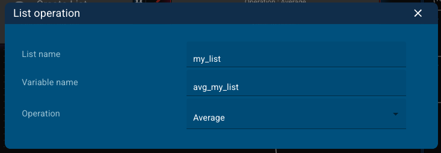

Here, the average of the elements of list `my_list` is computed and stored in variable `avg_my_list`. The result is the following:

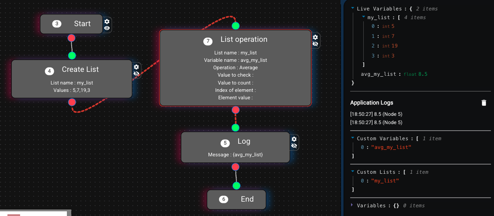

# Examples

to be created...