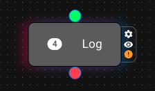
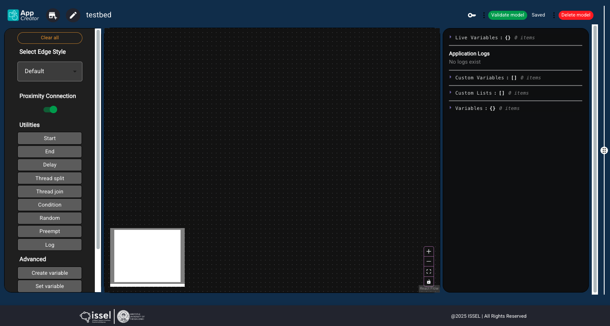
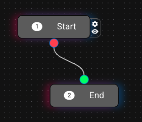
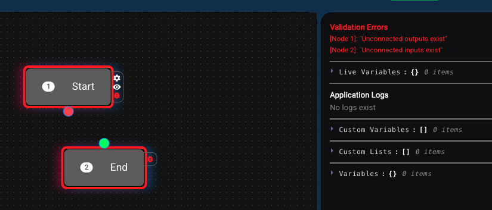
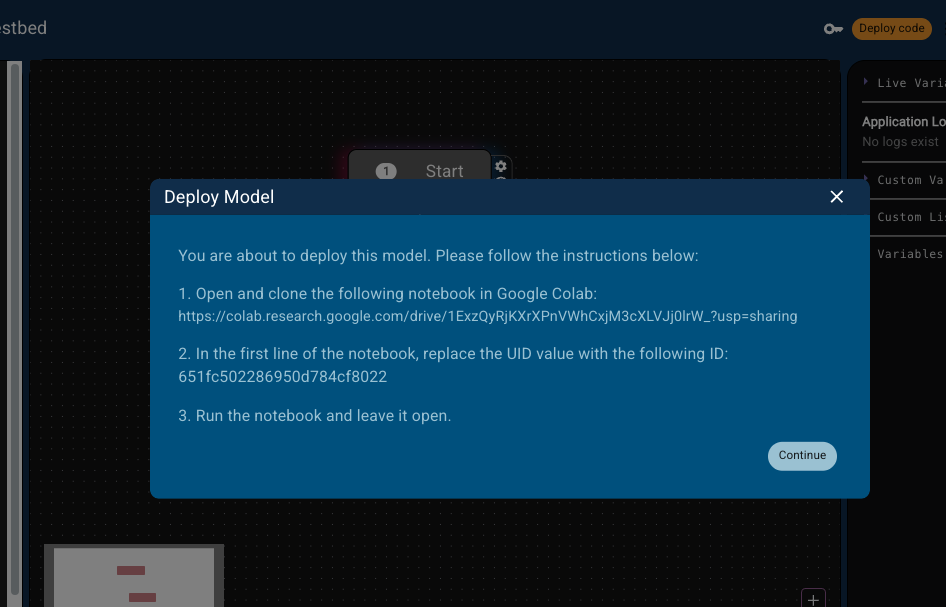

# AppCreator documentation

This the the AppCreator documentation, powered by [LocSys](https://locsys.issel.ee.auth.gr/). AppCreator enables the utilization of heterogeneous toolboxes towards creating complex, multi-domain, flow/FSM based applications.

AppCreator follows a classical FSM-like approach, i.e. each node is executed and passes the execution batton into its next connection, as well as supports conditions to divert the flow according to checks.

Nevertheless, since the modern brokered systems are asynchronous in nature, AppCreator also supports enhancements over the classical FSM, i.e. execution of parallel threads and preemtion of threads according to conditions.

Finally, a design decision was to not support passing values from one node to another, but maintain a pool of variables that can be accessed from all nodes. This way the philosophy of creating an app is not about correctly manipulating data through the nodes, but use variables and focus on the logic part.

Next, the documentation of the two basic AppCreator toolboxes will be given, that offer the basis for all apps to be created.

## 1. Before the toolboxes...

### 1.1 Variables value substitution

When you want to use a variable's value in a field or replace it in an expression, you should use `{}`. For example, if I have the variable `x` whose value is `3` and I want to log `x = 3`, I should put this in the Log node:

> `x = {x}`

This way, the `{x}` will be substituted with the variable's value and the final output will be `x = 3`

### 1.2 Evaluating expressions

If you want to evaluate an expression which possibly includes variables (this does not apply for the Condition node, to be discussed later), you can enclose the expression in `||`. For example, if I want to log the double of the value of `x` I should out this in the Log node:

> `The double of variable x is |2 * {x}|`

This way, first the variables' values are substituted and the expression becomes `The double of variable x is |2 * 3|`, and then whatever is in `||` it is evaluated by Python, so the final output will be `The double of variable x is 6`.  

This has several implications, since this way you can use actual Python libraries, e.g. `|math.min({x})^5|`.

### 1.3 Nodes connectivity rules

There are two rules when connecting nodes:
- No input and output handles must remain unconnected. If you leave them unconnected, the validation will fail
- You can connect each output handle only once, but every input handle multiple times. This means that each output directs to a single node, but each input can be visited by many nodes.

### 1.4 Nodes properties

Some nodes have a little cog icon by their side. This means that they have properties that can be configured. Press the cog to see them.

If an orange exclamation mark exists besides a node, this means that it contains some properties that are obligatory and have not been set. Example:

## AppCreator environment and Hello world

This is how the AppCreator environment looks like:

There are three distinct areas:
- At the left we can see the **toolboxes** column. It contains all nodes of both the basic and other toolboxes, as well as options for the connectivity visualization of the application.
- At the middle there is the **application creation** canvas. You can drag and drop nodes from the toolboxes here, connect them and create apps.
- At the right there is the **logs and variables** column. This is more technical, so it will be described later on.

The hello world application of AppCreator contains two nodes, the Start and End node, which must always exist in any application. So the Hello world app looks like this:

At the top right of the AppCreator window there is a green button called `Validate model`. If you press this several consistency and sanity checks will be performed to your model, in order to be sure that the **structure** of the application is correct. Unfortunately, we cannot do this for the **logic** of your app, so you are responsible if anything goes wrong!

If any mistakes exist, a) they will appear at the top of the **logs and variables** column, b) the corresponding nodes will have a red highlight, and c) a bug icon will also appear in the respective nodes, which on hover will show you the error. For example, in the following application, two mistakes exist (the connections are missing).

If your model is validated, a green indication will appear, and the `Deploy code` orange button will appear. If you press the `Deploy code` button, you will see the following message:

If you **really** want to deploy, do what it tells you and press Continue!

## 2. The Utilities toolbox

### *Start*

The Start node must exist in each application, since the deployment starts from there. Its configuration has one property called `Artificial delay`. This is measured in seconds and denotes a delay that will be added after each node's execution. Use this in order to have time to see the actual flow.

Fun fact: you can have multiple Start nodes in your application. This means that the flows starting from these nodes will be initialized and executed in parallel.

### *End*

If you have a Start node, you must also have an End node. The End node is just the final node of an application, nothing more, nothing less.

### *Delay*

### *Thread split*

### *Thread join*

### *Condition*

### *Random*

### *Preempt*

### *Log*

## 3. The Advanced toolbox

### *Create variable*

### *Set variable*

### *Create list*

### *List operation*

### *List math operation*

# Examples