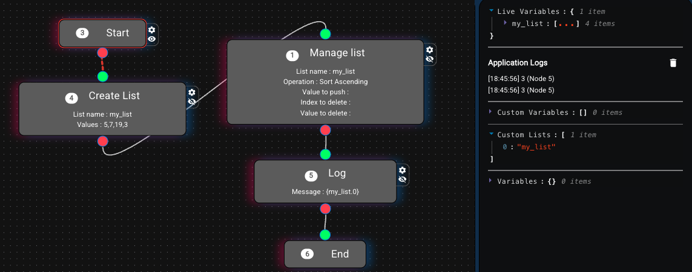
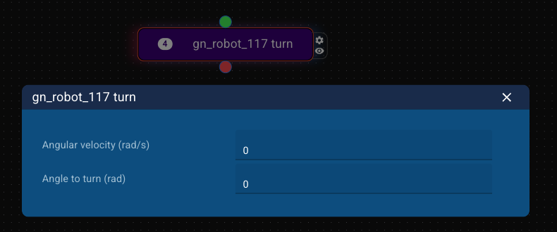

# AppCreator documentation

This the the AppCreator documentation, powered by [LocSys](https://locsys.issel.ee.auth.gr/). AppCreator enables the utilization of heterogeneous toolboxes towards creating complex, multi-domain, flow/FSM based applications.

AppCreator follows a classical FSM-like approach, i.e. each node is executed and passes the execution batton into its next connection, as well as supports conditions to divert the flow according to checks.

Nevertheless, since the modern brokered systems are asynchronous in nature, AppCreator also supports enhancements over the classical FSM, i.e. execution of parallel threads and preemtion of threads according to conditions.

Finally, a design decision was to not support passing values from one node to another, but maintain a pool of variables that can be accessed from all nodes. This way the philosophy of creating an app is not about correctly manipulating data through the nodes, but use variables and focus on the logic part.

Next, the documentation of the two basic AppCreator toolboxes will be given, that offer the basis for all apps to be created.

## 1. Some background knowledge

### 1.1 Variables value substitution

When you want to use a variable's value in a field or replace it in an expression, you should use `{}`. For example, if I have the variable `x` whose value is `3` and I want to log `x = 3`, I should put this in the Log node:

> `x = {x}`

This way, the `{x}` will be substituted with the variable's value and the final output will be `x = 3`

### 1.2 Evaluating expressions

If you want to evaluate an expression which possibly includes variables (this does not apply for the Condition node, to be discussed later), you can enclose the expression in `||`. For example, if I want to log the double of the value of `x` I should out this in the Log node:

> `The double of variable x is |2 * {x}|`

This way, first the variables' values are substituted and the expression becomes `The double of variable x is |2 * 3|`, and then whatever is in `||` it is evaluated by Python, so the final output will be `The double of variable x is 6`.  

This has several implications, since this way you can use actual Python libraries, e.g. `|math.min({x})^5|`.

### 1.3 Variables as data structures

In the case where a variable is a list or a json object (dictionary), you can access its elements using the dot notation. 

If we have a list `my_list = [0, 4, 7, 9]`, you can use `{my_list.1}` to get the element in the 1st place, i.e. 4.

If we have a dictionary like the following:
```
robot_pose_x = {
    pose: {
        x: 5
        y: 8.4
        theta: 0.34
    }
}
```

you can access x like this: `{robot_pose_x.pose.x}`.

### 1.4 Nodes connectivity rules

There are two rules when connecting nodes:
- No input and output handles must remain unconnected. If you leave them unconnected, the validation will fail
- You can connect each output handle only once, but every input handle multiple times. This means that each output directs to a single node, but each input can be visited by many nodes.

### 1.5 Nodes properties

Some nodes have a little cog icon by their side. This means that they have properties that can be configured. Press the cog to see them.

If an orange exclamation mark exists besides a node, this means that it contains some properties that are obligatory and have not been set. Example:


## 2. AppCreator environment and Hello world

This is how the AppCreator environment looks like:


There are three distinct areas:
- At the left we can see the **toolboxes** column. It contains all nodes of both the basic and other toolboxes, as well as options for the connectivity visualization of the application.
- At the middle there is the **application creation** canvas. You can drag and drop nodes from the toolboxes here, connect them and create apps.
- At the right there is the **logs and variables** column. This is more technical, so it will be described later on.

The hello world application of AppCreator contains two nodes, the Start and End node, which must always exist in any application. So the Hello world app looks like this:


At the top right of the AppCreator window there is a green button called `Validate model`. If you press this several consistency and sanity checks will be performed to your model, in order to be sure that the **structure** of the application is correct. Unfortunately, we cannot do this for the **logic** of your app, so you are responsible if anything goes wrong!

If any mistakes exist, a) they will appear at the top of the **logs and variables** column, b) the corresponding nodes will have a red highlight, and c) a bug icon will also appear in the respective nodes, which on hover will show you the error. For example, in the following application, two mistakes exist (the connections are missing).


If your model is validated, a green indication will appear, and the `Deploy code` orange button will appear. If you press the `Deploy code` button, you will see the following message:


If you **really** want to deploy, do what it tells you and press Continue!

## 3. The Utilities toolbox

### § *Start*

The Start node must exist in each application, since the deployment starts from there. Its configuration has one property called `Artificial delay`. This is measured in seconds and denotes a delay that will be added after each node's execution. Use this in order to have time to see the actual flow.

Fun fact: you can have multiple Start nodes in your application. This means that the flows starting from these nodes will be initialized and executed in parallel.

### § *End*

If you have a Start node, you must also have an End node. The End node is just the final node of an application, nothing more, nothing less.

### § *Delay*

The Delay node is used to introduce a delay in the execution of the flow. It has one obligatory parameter, which is the delay is seconds.

This parameter is evaluated, thus you can use variables as well (e.g. `{x}` where x is 3, will result in 3 seconds of delay).

### § *Log*

Log is an assistive node which prints whatever expression you add as its parameter. It has one parameter which is handled as a string, and it is evaluated as explained in sections 1.1 and 1.2.

The results appear in the "Application logs" section at the right column, as such:


### § *Random*

Random is a node that allows for randomness in the flow. It has the following typical form, which includes one entry point and N output handles, where `N>1`.


As evident, this node has two buttons denoted with the plus and minus signs `(+, -)`. If you press the `+` one more output is added, and the last output is removed when you press the `-`.

The configuration of a Random node with 3 outputs is evident below:


Each input box is associated with its respective output and the number inside represents the possibility of randomly selecting this exact output. E.g. in the above ./assets/image, output 1 will be selected with a probability of 0.2 (or 2 out of 10 times), whereas output 3 will be randomly selected with a probability of 0.7. In the specific example, the sum of all numbers equals 1.0, but this is not a limitation for this node. You can include whatever numbers you want, and the probability will be computed relatively to the sum of these numbers.

For example in the below case, output 2 will be selected with a probability of 9/(12+9+3) = 9/24.


### § *Condition*

Condition is another node with 1 input and N outputs, where N>1. A typical view of a Condition node with 3 outputs is the following:


Here, you declare N-1 conditions, and a "default" condition exists which is always True. The conditions are checked in the order of appearance, thus first Condition #1 will be evaluated, if it is False Condition #2 will be evaluated, and if it is False, the Default condition will be always met. Thus, since a default condition always exist you do not have to create all conditions that are logically complementary.

Each input text for each condition is evaluated, thus you can include `{}` for variables substitution or `||` for pythonic evaluation. In the aove example, if variable `x` is smaller than 5 the first output is selected, if it is larger than 10 the second output is selected, and it it is neither (thus `5 <= x <= 10`) the third output is selected.

### § *Thread split* and *Thread join*

The Thread split and Thread join nodes offer parallelism in your applications. As we said, AppCreator offers a synchronous, FSM-like flow from node to node. If you want process to be executed in parallel you must use a Thread split node.

A typical Thread split node with 3 outputs is evident below. When this is used, three threads will initiate and be executed in parallel, deploying the subflows connected to the three outputs.


The parallelism stops in a Thread join node. This node has N inputs and one output. Each of the inputs handles the ending of a thread, and the node concludes its execution when all the incoming threads are done.

A simple example follows:


Here the application will start and two delays will be executed in parallel (3 and 10 seconds).
The 3 seconds delay will end after 3 seconds (duh) and the execution flow will reach the input 0 of the join node. Since the second thread (the one with the 10 seconds delay) has not finished yet, the application execution stays in the join node for another 7 seconds, when the 10 second delay terminates as well. Then the application terminates.

### § *Kill process*

Even though the Thread nodes are powerful to handle real world problems, where several things happen at the same time, you will find out that you will usually combine them with the Preempt node. 

Kill process is an operation that can stop (kill) a whole thread. For example, if you have a Thread node with two outputs (thus it creates two threads), and at output 1 (the last) you add a Delay of 1 second and then a Kill node, for which you select the kill the above thread, the whole execution of this thread will stop after 1 second.

Let's see a more realistic (and complex) example:


Here we create a variable called `x` with initial value equal to 0, and then we create a thread split with two threads. The first thread (Node 11, output 0) executes a delay and increases the value of `x` by 1 for eternity.
The second thread (Node 11, output 1) executes in a loop a delay and a condition that checks if `x>10`. If no, the execution repeats the delay/condition pair. If yes, the flow reaches a Kill node, which kills the Thread 11, output 0 (so it stops the above thread and variable `x` stops to increase).

The catch here is that the Thread join node has only 1 input connection, since thread 0 is eternal, thus it never "joins". When the Kill happens, thread #1 joins, thread #0 terminates and the flow reaches the End node.

Even though this application could be created by designing a simple loop that included the variable update, delay and condition, there are cases where specific nodes are used which are blocking and last several seconds or even minutes, therefore, killing is the proper way to kill them. Futhermore killing is a way to stop several threads (not only one).

**Disclaimer**: When you are using Kill nodes you must know what you are doing! It is proposed to use Kill to kill threads that originate from the same Thread Split node the actual Kill is in, else you must REALLY know what you are doing!

### § *Create variable*

This node allows for declaring the creation of a new variable. A typical example of this node is the following:


In this node you must declare the variable's name (which is restricted according to pythonic variables naming rules), and the variable's initial value. The value can be a number, a string or an expression that will be evaluated (e.g. `|{x} + 2|`).
This variable falls under the category of "Custom" variables, to differentiate them from variables that are automatically introduced from 3rd party toolboxes. Thus, these variables are also visible in the right column, under the "Custom variables" section.

### § *Set variable*

This node updates the value of a variable that has been created using the "Create variable" node. A typical example is this:


Here, a variable called `variable_21` is created with an initial value of 15, and then its value is set to `3 * {variable_21}`, thus the final value is 45 (as shown in the live variables section at the right).

### § *Create list*

The Create list node... creates a list! A typical example of the Create list node is the following:


It should be stated that a list is a custom variable as well, but it is kept in a different place (the Custom lists section at the right) to be easier to distinguish. Like the custom variables you need to provide a name, and a set of initial elements by adding a value and pressing Enter (return).

### § *Manage list*

This node offers standard functions over lists, i.e. to delete an element, to add an element, and to order (ascending or descending). A typical view of this node follows:


The name of the list must be declared, and the operation should be selected from a dropdown.
An example application where a list is created, is ordered in ascending order and the first element is logged follows:



It should be stated that this node performs operations on the list itself, thus it changes its structure.

### § *List operation*

This node offers specific list-oriented mathematical operations, applied in a created list. Since the outcome of this node is a value (or values), the user is prompted to store the result in a custom variable. A typical example of this node is the following:


Here, the average of the elements of list `my_list` is computed and stored in variable `avg_my_list`. The result is the following:


## 4. The EnvPop toolbox

LocSys provides the [EnvPop](https://locsys.issel.ee.auth.gr/dsls/envpop) to AppCreator transformation, allowing to create graphical applications for IoT and Cyber Physical Systems. EnvPop is a graphical domain specific language that describes a world, along with its elements, and can be simulated via [Streamsim](https://github.com/robotics-4-all/streamsim), a simple 2D simulator developed in Python. EnvPop provides several sensors, effectors, actors and robotic devices to describe a fully functional world, and Streamsim brings it to life.

As aforementioned, EnvPop supports transformation to AppCreator, meaning that the described elements are transformed into toolboxes and available variables. Instead of describing all node separately, a explanation of what each EnvPop element provides will follow.

### § *Start and Stop simulation*

When you transform from EnvPop, you will see two new nodes, named `Start Simulation` and `Stop Simulation`. 

The Start simulation node essentially selects an EnvPop model and dispatches it to Streamsim in order to start the simulation. Start simulation has a predefined selection of the EnvPop model from which it was transformed into.

On the contrary, Stop Simulation does not have any parameters, since it just stops the active simulation. It is important to remember to **use this node if you have used a Start Simulation node**, so as for the simulation to end gracefully.

### § *Humidifier effector*

The humidifier environmental effector acts as a hummidifer and dehumidifier at the same time. It provides a simplified functionality, where you set a humidity and it tries to set the humidity nearby at the same level. It must be stated that humidifier has a range of operation, where its effect is reduced linearly (i.e. the humidity at its pose is the denoted, and 0 at the range's limit).
Humidifier offers a `set` node, where you can declare the humidity and an initiator, like such:


The humidity value is a percentage (0-100) and in the initiator field you can declare a **robot's name** in case this device is defined as a device that can be handled via proximity. In that case, the device can change state only when a robot is nearby and its name is declared in the initiator field.

Furthermore, humidifier offers the `NAME.state` variable, where name is the device's name as declared in EnvPop, which is updated when the state of the device changes (for the image above the variable is `ef_humidifier_118.state`).

### § *Light effector*

The light effector is actually a... light. You can declare the R, G and B channels separately, as well as the luminosity percentage. Lights offer a `set` node, a typical example of which is this:


In the initiator field you can declare a **robot's name** in case this device is defined as a device that can be handled via proximity. In that case, the device can change state only when a robot is nearby and its name is declared in the initiator field.

Furthermore, if offers the following variables:
- `NAME.state.r`
- `NAME.state.g`
- `NAME.state.b`
- `NAME.state.luminosity`

where name is the device's name as declared in EnvPop, which is updated when the state of the device changes (for the image above the variable's name is `ef_light_119`).

### § *Relay effector*

A relay device is a combination of a relay, a switch or a state-defined effector. A relay has a predefined set of states it can take, and provides a `set` node, as shown below:


As evident, you can set its state with a dropdown menu, including only the supported states for this effector. 

In the initiator field you can declare a **robot's name** in case this device is defined as a device that can be handled via proximity. In that case, the device can change state only when a robot is nearby and its name is declared in the initiator field.

Relays offer only one variable, namely `NAME.state`, where NAME is the name of the device.

### § *Speaker effector*

A speaker is a device which produces sound (a speaker!). For simplification purposes, speakers only offer a node named `speak`, where you can declare a string to be dictated, the volume from 0-100 and the language (EN/EL). A typical example of a speaker is the following:


Speakers do not provide any variables.

### § *Thermostat effector*

Thermostats are essentially air-conditions, meaning that you can set a temperature and the thermostat tries to apply this temperature at its pose and in its vicinity. It must be stated that a thermostat has a range of operation, where its effect is reduced linearly (i.e. the temperature at its pose is the denoted, and 0 at the range's limit).

A thermostat provides a `set` node, where you declare the temperature, as such:


In the initiator field you can declare a **robot's name** in case this device is defined as a device that can be handled via proximity. In that case, the device can change state only when a robot is nearby and its name is declared in the initiator field.

Thermostats offer only one variable, namely `NAME.state`, where NAME is the name of the device.

### § *Ambient light sensor*

An ambient light sensor senses the luminosity of the environment at its pose. This sensor is affected by:
- The environmental luminosity as declared in the EnvPop model (may be static or dynamically altered)
- Environmental lights in its vicinity
- Robot leds in its vicinity

The ambient light sensor returns a luminosity percentage, by aggregating all the sources that affect it. For example, if the luminosity generated by a nearby light is 80% and the environmental luminosity is 50%, the sensor will return 80%. On the contrary, if the environmental luminosity is 90% (day) and we turn on a light that offers 75% luminosity to the sensor, the measurement will be 90%.

This device offers a `set state` node, where you can turn it on and off, as such:


In the initiator field you can declare a **robot's name** in case this device is defined as a device that can be handled via proximity. In that case, the device can change state only when a robot is nearby and its name is declared in the initiator field.

The ambient light sensor offers two variables:
- `NAME.value` which holds the detected luminosity
- `NAME_state.state` which holds whether the sensor operates or not

### § *Area alarm sensor*

The area alarm sensor is triggered when a robot enters its range of operation. This device offers a `set state` node, where you can turn it on and off, as such:


In the initiator field you can declare a **robot's name** in case this device is defined as a device that can be handled via proximity. In that case, the device can change state only when a robot is nearby and its name is declared in the initiator field.

This sensor offers two variables:
- `NAME.value` which holds the detection state
- `NAME_state.state` which holds whether the sensor operates or not

### § *Camera sensor*

Cameras are sensors that capture an instance of the environment. For simplification reasons, a camera offers two nodes `detect` and `set state`. Regarding the `set state` node, a typical example follows:


In the initiator field you can declare a **robot's name** in case this device is defined as a device that can be handled via proximity. In that case, the device can change state only when a robot is nearby and its name is declared in the initiator field.

Regarding the `detect` node, an example follows:


This node offers the functionality to detect an element on demand. By detect, we mean to check if a detectable entity of the declared type is in the field of view of the sensor. Things that you can detect include:

- Humans by detecting Face, Gender, Age, Emotion, Motion
- QR codes
- Barcodes
- Texts
- Colors (affected both the Text actors and by Lights)
- Other robots

A camera offers several variables, namely:
- `NAME_state.state` denoting whether it is on or off
- `NAME.detection.face.result`: Boolean
- `NAME.detection.face.value`: The value related to the detection (what has been detected)
- `NAME.detection.gender.result`: Boolean
- `NAME.detection.gender.value`: The value related to the detection (what has been detected)
- `NAME.detection.age.result`: Boolean
- `NAME.detection.age.value`: The value related to the detection (what has been detected)
- `NAME.detection.emotion.result`: Boolean
- `NAME.detection.emotion.value`: The value related to the detection (what has been detected)
- `NAME.detection.motion.result`: Boolean
- `NAME.detection.motion.value`: The value related to the detection (what has been detected)
- `NAME.detection.qr.result`: Boolean
- `NAME.detection.qr.value`: The value related to the detection (what has been detected)
- `NAME.detection.barcode.result`: Boolean
- `NAME.detection.barcode.value`: The value related to the detection (what has been detected)
- `NAME.detection.text.result`: Boolean
- `NAME.detection.text.value`: The value related to the detection (what has been detected)
- `NAME.detection.color.result`: Boolean
- `NAME.detection.color.value`: The value related to the detection (what has been detected)
- `NAME.detection.robot.result`: Boolean
- `NAME.detection.robot.value`: The value related to the detection (what has been detected)

It must be stated that the sensor detects the element of the desired type that is closest, not all detectable elements in its operation range.

**Beware**: The results of the camera detection are directly correlated to the luminosity at the point of the detectable entity. For example, if luminosity is 50%, the detection will succeed 50% of the times.

### § *Distance sensor*

A distance sensor is a pure directional sensor that measures distance to an obstacle. In our case, obstacles are either walls or other robots.

This device offers a `set state` node, where you can turn it on and off, as such:


In the initiator field you can declare a **robot's name** in case this device is defined as a device that can be handled via proximity. In that case, the device can change state only when a robot is nearby and its name is declared in the initiator field.

This sensor offers two variables:
- `NAME.distance` which holds the detected distance
- `NAME_state.state` which holds whether the sensor operates or not

### § *Gas sensor*

A gas sensor measures the CO2 density at its pose. The gas sensor is affected by:
- The environmental CO2 density, as denoted in the EnvPop model
- Nearby fires
- Nearby humans

This device offers a `set state` node, where you can turn it on and off, as such:


In the initiator field you can declare a **robot's name** in case this device is defined as a device that can be handled via proximity. In that case, the device can change state only when a robot is nearby and its name is declared in the initiator field.

This sensor offers two variables:
- `NAME.value` which holds the detected value
- `NAME_state.state` which holds whether the sensor operates or not

### § *Humidity sensor*

The humidity sensor detects the humidity percentage at its pose. It is affected by:
- Humidifier effectors
- Bodies of water nearby

This device offers a `set state` node, where you can turn it on and off, as such:


In the initiator field you can declare a **robot's name** in case this device is defined as a device that can be handled via proximity. In that case, the device can change state only when a robot is nearby and its name is declared in the initiator field.

This sensor offers two variables:
- `NAME.value` which holds the detected value
- `NAME_state.state` which holds whether the sensor operates or not

### § *Linear alarm sensor*

The linear alarm sensor is triggered when a robot crosses the line created by its two anchors. This device offers a `set state` node, where you can turn it on and off, as such:


In the initiator field you can declare a **robot's name** in case this device is defined as a device that can be handled via proximity. In that case, the device can change state only when a robot is nearby and its name is declared in the initiator field.

This sensor offers two variables:
- `NAME.value` which holds the detection state
- `NAME_state.state` which holds whether the sensor operates or not

### § *Microphone sensor*

Microphones can capture sound. Similarly to the cameras, these are complex sensors that are simplified, offering two nodes: `detect` and `set state`. Regarding the `set state` node, a typical example follows:


In the initiator field you can declare a **robot's name** in case this device is defined as a device that can be handled via proximity. In that case, the device can change state only when a robot is nearby and its name is declared in the initiator field.

Regarding the `detect` node, an example follows:


This node offers the functionality to detect an element on demand. By detect, we mean to check if a detectable entity of the declared type is in the field of operation of the sensor. Things that you can detect include:

- Humans by detecting Sound, Language, Emotion, SpeechToText (what is being said)

A microphone offers several variables, namely:
- `NAME_state.state` denoting whether it is on or off
- `NAME.detection.sound.result`: Boolean
- `NAME.detection.sound.value`: The value related to the detection (what has been detected)
- `NAME.detection.language.result`: Boolean
- `NAME.detection.language.value`: The value related to the detection (what has been detected)
- `NAME.detection.emotion.result`: Boolean
- `NAME.detection.emotion.value`: The value related to the detection (what has been detected)
- `NAME.detection.speech2text.result`: Boolean
- `NAME.detection.speech2text.value`: The value related to the detection (what has been detected)

It must be stated that the sensor detects the element of the desired type that is closest, not all detectable elements in its operation range.

### § *pH sensor*

The pH sensor measures the pH at its pose. Right now this sensor is affected only by the environmental pH as denoted in the respective EnvPop model.

This device offers a `set state` node, where you can turn it on and off, as such:


In the initiator field you can declare a **robot's name** in case this device is defined as a device that can be handled via proximity. In that case, the device can change state only when a robot is nearby and its name is declared in the initiator field.

This sensor offers two variables:
- `NAME.value` which holds the detected value
- `NAME_state.state` which holds whether the sensor operates or not

### § *Temperature sensor*

The temperature sensor measures the temperature at its pose. This sensor is affected by:
- The environmental temperature as declared in the respective EnvPop model
- Fires in its vicinity
- Thermostats in its vicinity

This device offers a `set state` node, where you can turn it on and off, as such:


In the initiator field you can declare a **robot's name** in case this device is defined as a device that can be handled via proximity. In that case, the device can change state only when a robot is nearby and its name is declared in the initiator field.

This sensor offers two variables:
- `NAME.value` which holds the detected value
- `NAME_state.state` which holds whether the sensor operates or not

### § *Pan-tilt effector*

Even though in EnvPop you cannot drag and drop a pan-tilt effector, you can declare it as a host in directional sensors, i.e. distance sensors and cameras. A pan tilt mechanism is essentially two motors attached together, offering rotation capabilities in the yaw direction (left-right) and in the pitch direction (up-down). Since Streamsim, the underlying simulator, is 2D, pan-tilts can only be turned left and right by setting the `pan` attribute.

Pan-tilt is an effector, thus you can set its state like so:


It offers two variables, namely:
- `NAME.state.pan`
- `NAME.state.tilt`

### § *Robot*

A robot is a composite device that a) can move on demand, and b) hosts other devices like sensors and effectors. Let's see what a robot can carry and how it is used:

#### § *Microphone*

Microphones can capture sound. Similarly to the cameras, these are complex sensors that are simplified, offering one node named `detect`. An example follows:


This node offers the functionality to detect an element on demand. By detect, we mean to check if a detectable entity of the declared type is in the field of operation of the sensor. Things that you can detect include:

- Humans by detecting Sound, Language, Emotion, SpeechToText (what is being said)

A microphone offers several variables, namely:
- `NAME.detection.sound.result`: Boolean
- `NAME.detection.sound.value`: The value related to the detection (what has been detected)
- `NAME.detection.language.result`: Boolean
- `NAME.detection.language.value`: The value related to the detection (what has been detected)
- `NAME.detection.emotion.result`: Boolean
- `NAME.detection.emotion.value`: The value related to the detection (what has been detected)
- `NAME.detection.speech2text.result`: Boolean
- `NAME.detection.speech2text.value`: The value related to the detection (what has been detected)

It must be stated that the sensor detects the element of the desired type that is closest, not all detectable elements in its operation range.

#### § *Camera*

Cameras are sensors that capture an instance of the environment. For simplification reasons, a camera offers one nodes, named `detect`. An example follows:


This node offers the functionality to detect an element on demand. By detect, we mean to check if a detectable entity of the declared type is in the field of view of the sensor. Things that you can detect include:

- Humans by detecting Face, Gender, Age, Emotion, Motion
- QR codes
- Barcodes
- Texts
- Colors (affected both the Text actors and by Lights)
- Other robots

A camera offers several variables, namely:
- `NAME.detection.face.result`: Boolean
- `NAME.detection.face.value`: The value related to the detection (what has been detected)
- `NAME.detection.gender.result`: Boolean
- `NAME.detection.gender.value`: The value related to the detection (what has been detected)
- `NAME.detection.age.result`: Boolean
- `NAME.detection.age.value`: The value related to the detection (what has been detected)
- `NAME.detection.emotion.result`: Boolean
- `NAME.detection.emotion.value`: The value related to the detection (what has been detected)
- `NAME.detection.motion.result`: Boolean
- `NAME.detection.motion.value`: The value related to the detection (what has been detected)
- `NAME.detection.qr.result`: Boolean
- `NAME.detection.qr.value`: The value related to the detection (what has been detected)
- `NAME.detection.barcode.result`: Boolean
- `NAME.detection.barcode.value`: The value related to the detection (what has been detected)
- `NAME.detection.text.result`: Boolean
- `NAME.detection.text.value`: The value related to the detection (what has been detected)
- `NAME.detection.color.result`: Boolean
- `NAME.detection.color.value`: The value related to the detection (what has been detected)
- `NAME.detection.robot.result`: Boolean
- `NAME.detection.robot.value`: The value related to the detection (what has been detected)

It must be stated that the sensor detects the element of the desired type that is closest, not all detectable elements in its operation range.

**Beware**: The results of the camera detection are directly correlated to the luminosity at the point of the detectable entity. For example, if luminosity is 50%, the detection will succeed 50% of the times. Thus, you can use the robot's LEDs to increase luminosity when you want to detect something.

#### § *IMU*

IMU stands for Inertia Measurement Unit and is a device that can measure and report specific gravity and angular rate of an object to which it is attached. In our case the robot's IMU offers two variables namely:

- `NAME.data.accelleration.x` from which you can understand if the robot moves
- `NAME.data.magnetometer.yaw` from which you can get the robot's absolute orientation in the map

#### § *Environmental*

Environmental sensors are composite devices that host several sensors. In our case, the environmental sensor offers measurements of temperature, humidity, pressure and gas quality, thus it provides the following variables:

- `NAME.data.temperature`
- `NAME.data.pressure`
- `NAME.data.gas`
- `NAME.data.humidity`

Temperature values are affected by
- The environmental temperature as declared in the respective EnvPop model
- Fires in its vicinity
- Thermostats in its vicinity

Gas values are affected by
- The environmental CO2 density, as denoted in the EnvPop model
- Nearby fires
- Nearby humans

Humidity values are affected by
- Humidifier effectors
- Bodies of water nearby

#### § *Speaker*

A speaker is a device which produces sound (a speaker!). For simplification purposes, speakers only offer a node named `speak`, where you can declare a string to be dictated, the volume from 0-100 and the language (EN/EL). A typical example of a speaker is the following:


Speakers do not provide any variables.

#### § *LEDs*

The leds essentially lights. You can declare the R, G and B channels separately, as well as the luminosity percentage. LEDs offer a `set` node, a typical example of which is this:


Furthermore, if offers the following variables:
- `NAME.state.r`
- `NAME.state.g`
- `NAME.state.b`
- `NAME.state.luminosity`

where name is the device's name as declared in EnvPop, which is updated when the state of the device changes.

#### § *RFID reader*

The RFID reader can detect RFID tags in its vicinity. It offers a variable named `NAME.data.tags`, which returns a dictionary of tags, where each pair has the id of the tag as a key and its message as value.

#### § *Sonars*

Sonars are similar to distance sensor, i.e. they are purely directional sensors that measure distance to an obstacle. In our case, obstacles are either walls or other robots.

This sensor offers a variables:
- `NAME.distance` which holds the detected distance

#### § *Pan-tilt*

Even though in EnvPop you cannot declare a pan-tilt effector on top a robot in an explicit way, you can declare it as a host in directional sensors, i.e. distance sensors and cameras. A pan tilt mechanism is essentially two motors attached together, offering rotation capabilities in the yaw direction (left-right) and in the pitch direction (up-down). Since Streamsim, the underlying simulator, is 2D, pan-tilts can only be turned left and right by setting the `pan` attribute.

Pan-tilt is an effector, thus you can set its state like so:


It offers two variables, namely:
- `NAME.state.pan`
- `NAME.state.tilt`

#### § Robot motion

Robots can move. In our case, you can control the motion in different ways. AppMaker offers 5 different ways to handle a robot, all of which directly, or indirectly, set the robot's linear and rotational velocities. Linear velocity defines how the robot moves linearly (front-back), whereas rotational (aka angular) velocity defines how quick the robot turns.

##### I: Velocity set

The velocity set node explicitly sets the linear and rotational velocities of the robot. The robot **keeps these velocities** until a new similar command exists. A typical example is the following:


##### II: Move distance

The move distance node offers a layer of automation, since you can declare a linear velocity and a distance, and the robot will traverse this distance with the declared velocity and then it will stop. A typical example follows:


This node is **blocking**, meaning that the flow does not continue until the robot has finished its motion.

##### III: Move duration

The move duration node offers a layer of automation, since you can declare a set of linear/angular velocity and a duration, and the robot will take these values and will stop after the duration. A typical example follows:


This node is **blocking**, meaning that the flow does not continue until the robot has finished its motion.

##### IV: Turn

The turn node offers a layer of automation, since you can declare an angular velocity and an angle, and the robot will turn until it traverses the declared angle. A typical example follows:



This node is **blocking**, meaning that the flow does not continue until the robot has finished its motion.

##### V: Go to POI

This node offers the functionality of automatically traversing to a POI (Point of Interest). POIs are denoted in EnvPop as blue dots, and are usually offered as anchors for assistive or important places. This node lets you select the POI to go using a dropdown list, and declare a linear and rotational velocity. An example follows:


This node is **blocking**, meaning that the flow does not continue until the robot has finished its motion.

Also **the robot will try to go directly to the POI, thus it does not perform obstacle avoidance**.

# Examples 

Coming soon...